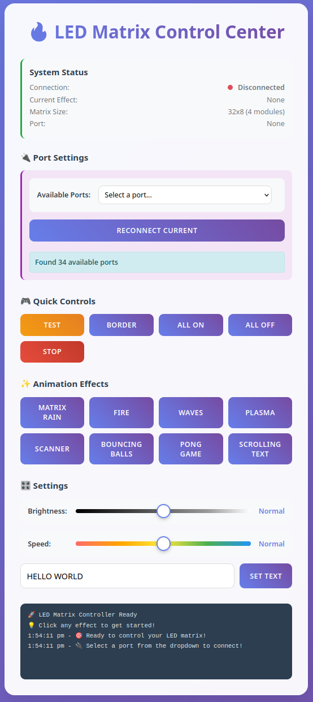

# LED Matrix Control Suite

A complete LED matrix controller and animation system for the Raspberry Pi Pico using MicroPython and a web-based UI. This project allows you to send commands and animations to a 32x8 LED matrix display over serial using a modern, responsive web interface.

---

## 🔧 Features
- Web UI built with Flask and HTML/JS
- Select serial device from dropdown (backend-driven)
- Multiple animated effects:
  - Matrix Rain
  - Fire simulation
  - Plasma, Waves, Scanner
  - Bouncing Balls
  - Pong game
  - Clock display (12/24h, blinking colon, with/without seconds)
  - Scrolling text
- Brightness and speed controls
- Custom text support
- Tested on Raspberry Pi Pico

---

## 🧠 Inspiration & Credit
- Inspired by the **WOPR LED Enclosure** project:
  [https://www.printables.com/model/1167457-1u-rack-mount-wopr-leds-enclosure](https://www.printables.com/model/1167457-1u-rack-mount-wopr-leds-enclosure)

- Hardware driver via `max7219.py`:
  [https://github.com/mcauser/micropython-max7219](https://github.com/mcauser/micropython-max7219)
- Guide for wiring and setup:
  [MicrocontrollersLab - MAX7219 with Pi Pico](https://microcontrollerslab.com/max7219-led-dot-matrix-display-raspberry-pi-pico)
- [Claude](https://claude.ai/)
---

## 📦 Hardware Requirements
- Raspberry Pi Pico (with MicroPython installed)
- MAX7219 8x8 LED Matrix (4 modules recommended, e.g. 32x8)
- Jumper wires, breadboard

### Wiring Example (SPI0)
```
Raspberry Pi Pico pinout diagram (with MAX7219 wiring)

                                              ┌╌ LED (GP25)
                                              ┆ ┏━━━━┓
                                          ┌─────┃    ┃─────┐
UART0 TX | I2C0 SDA | SPI0 RX  | GP0  | 01│●  ┆ ┗━━━━┛    ●│40 | VBUS     <─── MAX7219 VCC
UART0 RX | I2C0 SCL | SPI0 CSn | GP1  | 02│●  ⏄           ●│39 | VSYS
                                 GND  | 03│■              ■│38 | GND      <─── MAX7219 GND
           I2C1 SDA | SPI0 SCK | GP2  | 04│●    ╭─╮       ●│37 | 3V3_EN
           I2C1 SCL | SPI0 TX  | GP3  | 05│●    │ │       ●│36 | 3V3(OUT)
UART1 TX | I2C0 SDA | SPI0 RX  | GP4  | 06│●    ╰─╯       ●│35 |          | ADC_VREF
UART1 RX | I2C0 SCL | SPI0 CSn | GP5  | 07│●              ●│34 | GP28     | ADC2
                                 GND  | 08│■              ■│33 | GND      | AGND
           I2C1 SDA | SPI0 SCK | GP6  | 09│●   ┌─────┐    ●│32 | GP27     | ADC1     | I2C1 SCL
           I2C1 SCL | SPI0 TX  | GP7  | 10│●   │     │    ●│31 | GP26     | ADC0     | I2C1 SDA
UART1 TX | I2C0 SDA | SPI1 RX  | GP8  | 11│●   │     │    ●│30 | RUN
UART1 RX | I2C0 SCL | SPI1 CSn | GP9  | 12│●   └─────┘    ●│29 | GP22
                                 GND  | 13│■              ■│28 | GND
           I2C1 SDA | SPI1 SCK | GP10 | 14│●              ●│27 | GP21     |          | I2C0 SCL
           I2C1 SCL | SPI1 TX  | GP11 | 15│●              ●│26 | GP20     |          | I2C0 SDA
UART0 TX | I2C0 SDA | SPI1 RX  | GP12 | 16│●              ●│25 | GP19     | SPI0 TX  | I2C1 SCL
UART0 RX | I2C0 SCL | SPI1 CSn | GP13 | 17│●              ●│24 | GP18     | SPI0 SCK | I2C1 SDA
                                 GND  | 18│■              ■│23 | GND
           I2C1 SDA | SPI1 SCK | GP14 | 19│●              ●│22 | GP17     | SPI0 CSn | I2C0 SCL | UART0 RX
           I2C1 SCL | SPI1 TX  | GP15 | 20│●     ● ■ ●    ●│21 | GP16     | SPI0 RX  | I2C0 SDA | UART0 TX
                                          └────────────────┘
                                                 ┆ ┆ ┆
                                                 ┆ ┆ └╌ SWDIO
                                                 ┆ └╌╌╌ GND
                                                 └╌╌╌╌╌ SWCLK

MAX7219 ↔ Pico Wiring Summary:
──────────────────────────────
VCC   → VBUS    (Pin 40)
GND   → GND     (Pin 38 or 3 or 8 or 13 or 18 or 23 or 28 or 33)
DIN   → GP3     (Pin 5)   — SPI0 TX
CS    → GP5     (Pin 7)   — SPI0 CSn
CLK   → GP2     (Pin 4)   — SPI0 SCK
```
---

## 💻 Uploading to the Pico
1. Flash MicroPython firmware to the Raspberry Pi Pico
2. Use [Thonny](https://thonny.org/) to:
   - Upload `main.py` and `max7219.py` to the Pico
   - Set `main.py` as the startup script
3. Open Thonny’s serial terminal to view logs or test input commands

---

## 🌐 Running the Web UI

### Option 1: Manual Setup
1. Clone this repo on your desktop machine
2. Install dependencies (Python 3.x)
   ```bash
   pip install flask pyserial
   ```
3. Run the web controller:
   ```bash
   python clients/web/server.py
   ```
4. Visit `http://localhost:5000` in your browser
5. Select a serial port, click connect, and send effects!

### Option 2: Install as System Service (Arch Linux)
For a production setup that starts automatically on boot:

1. Clone this repo and navigate to the project directory
2. Run the installation script as root:
   ```bash
   sudo ./install.sh
   ```
3. The service will be installed and started automatically
4. Visit `http://localhost:5123` or `http://YOUR_IP:5123` in your browser

**Service Management:**
```bash
# Check service status
sudo systemctl status picopixels-server

# Start/stop/restart service
sudo systemctl start picopixels-server
sudo systemctl stop picopixels-server
sudo systemctl restart picopixels-server

# View live logs
sudo journalctl -u picopixels-server -f

# Update the service (run from project directory)
sudo picopixels-update
```

**Features of the service installation:**
- Runs as dedicated `picopixels` user with minimal privileges
- Automatically starts on system boot
- Includes security hardening
- Easy update mechanism
- Proper logging via systemd journal

---

## 🛠️ Commands (via Web UI or Serial)
- `start <effect>` – Start looping animation
- `stop` – Stop current animation
- `<effect>` – Run effect once (e.g. `test`, `border`, `on`, `off`)
- `brightness <0-15>` – Set brightness
- `speed <ms>` – Set speed of animation
- `text <message>` – Set scrolling text
- `clock [12/24] [seconds/noseconds] [blink/noblink]`
- `help` – Show command list
-

---

## 📸 Screenshots


---


## 3D Printed Enclosure
The enclosure was designed using [FreeCAD](https://www.freecad.org/)
The Pi Pico holder was downloaded from [Raspberry Pi Pico Case](https://www.printables.com/model/143745-raspberry-pi-pico-case)
